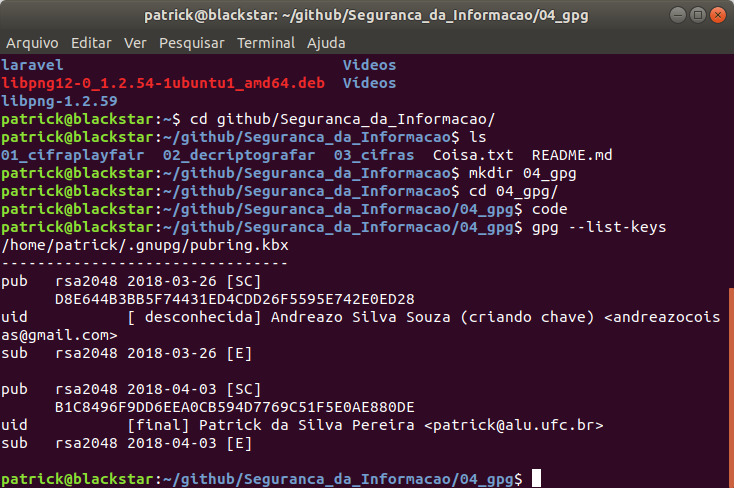

1-) criar, colocar foto e publicar sua chave no servidor remoto 

2-)importar a chave de outra pessoa do servidor remoto. Eu i,portei a chave do Andreazo e adicionei a minha lista 

3-) enviar uma mensage assinada em texto plano. Mensagem enviada foi: echo "Minha mensagem" > mensagem.txt

4-)enviar um arquivo .doc com assinatura em arquivo anexo Os Arquivo de Mensagem criado e Criptografados estão em anexo a esse documento. 
5-)assinar a chave do seu colega e reenviar ao servidor 
6-)verificar a assinatura no servidor remoto
