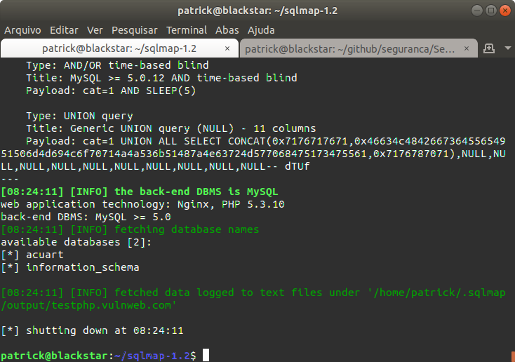
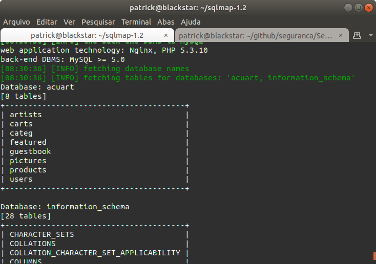
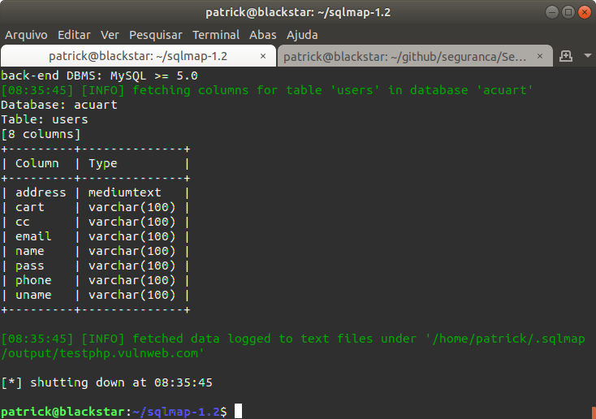
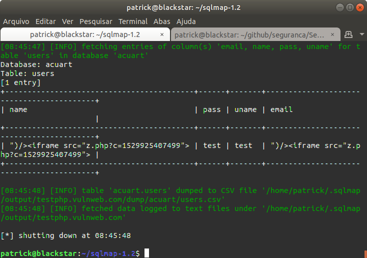
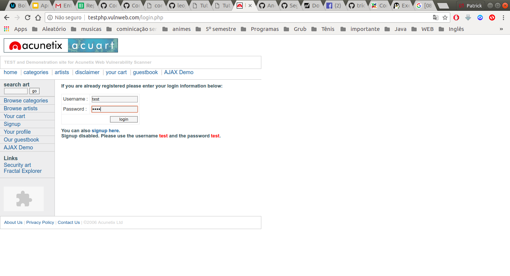
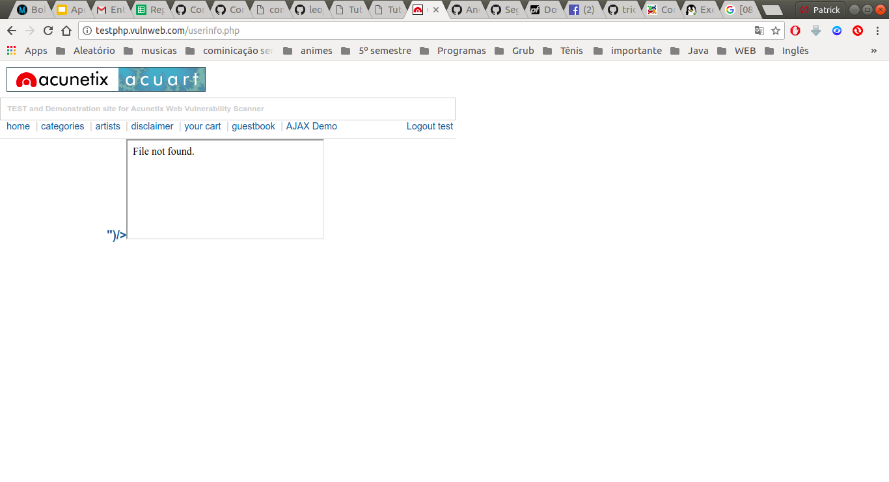

# Prática de Sql Injection

Site de testes http://testphp.vulnweb.com/listproducts.php?cat=1

### Passo 1

Descobrindo o banco de dados do site 

### Passo 2

Descobrindo as tabelas do site

### Passo 3

Descobrindo as colunas da tabela users

### Passo 4

Descobrindo o conteúdo da dos campos name, pass, uname, email da tabela users

### Passo 5

Entrando com usuário do usuário descoberto

Não tive muita dificuldade nesta prática, ela foi bem simples!
