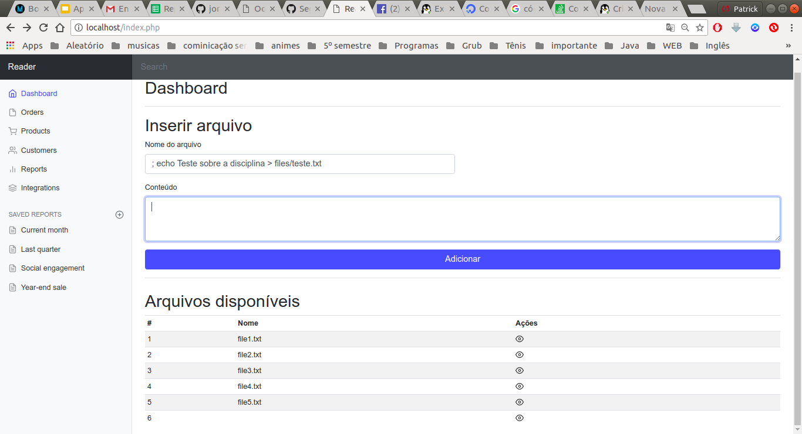
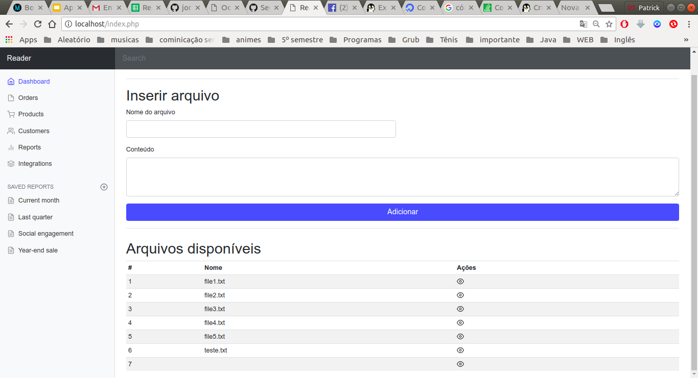
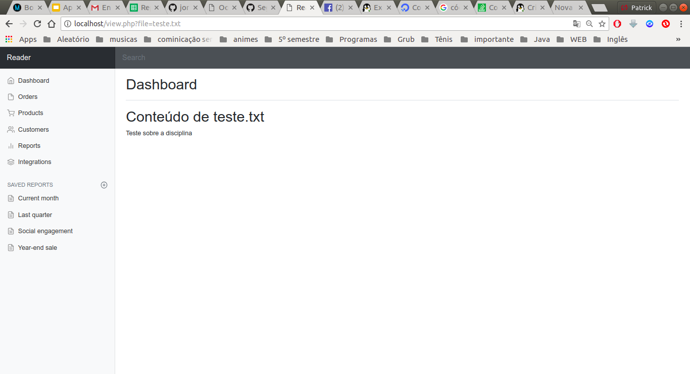
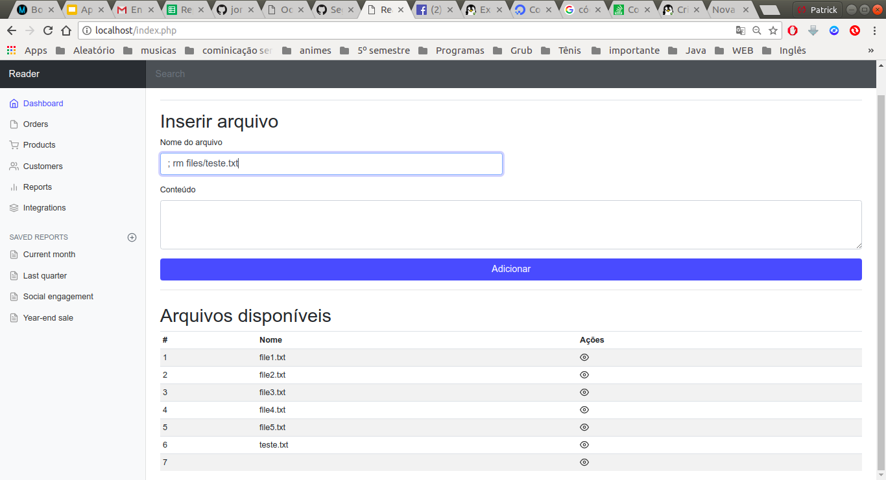
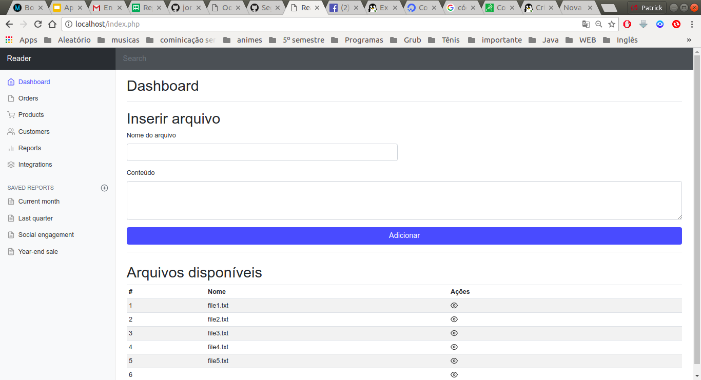

## Prática de Command Injection

Site retirado da prática do Command Injection

### Atividade 1

#### Passo 1

Criando um arquivo dentro de files

Arquivo teste.txt criado

#### Passo 2

Lista o conteúdo de dentro do arquivo teste criado

#### Passo 3 

Remover arquivo teste

## Atividade 2

Não foi possível realizar a atividade pois está fora do ar, pois faltei a aula de command injection e só foi disponibilizada no dia.
