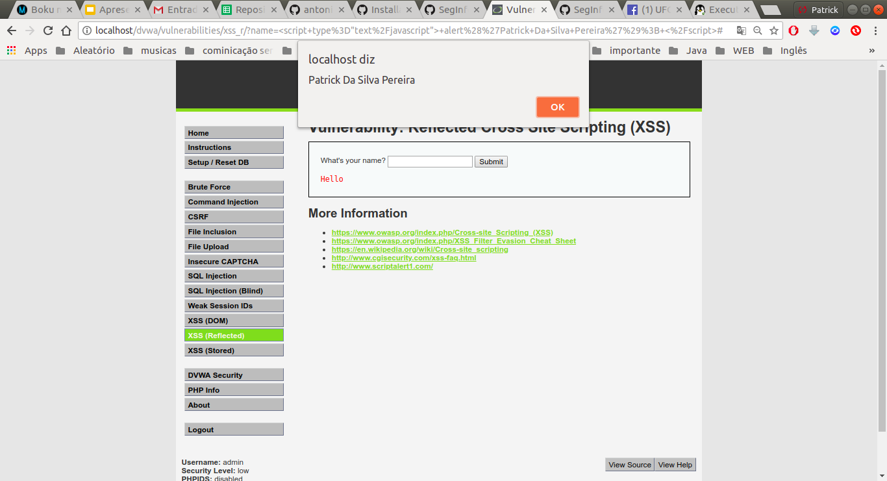
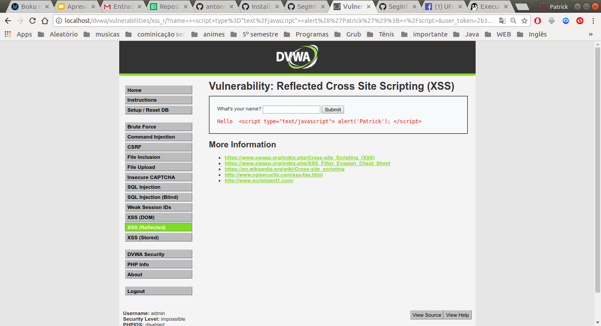

## Prática de XSS

Foi fei a instalação de DVWA, estou apenas mostrando a prática que foi solicitada

### Passo 1

Mudei a vunerabilidade para low e inserir o comando scrip  

### Passo 2

Mudei a vunerabilidade para impossible e mostrou essa messagem

