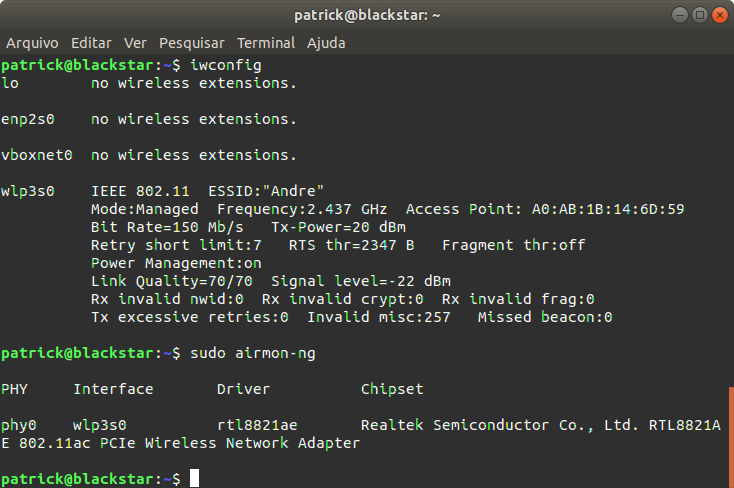
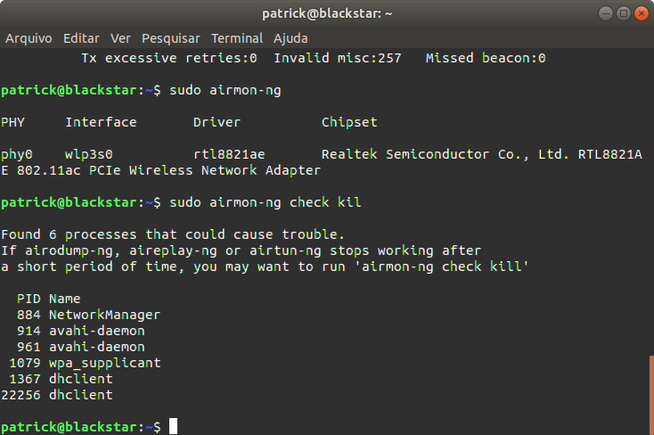
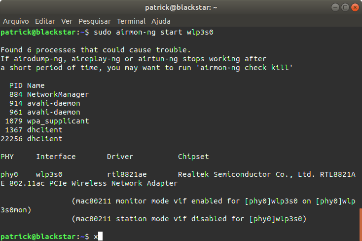
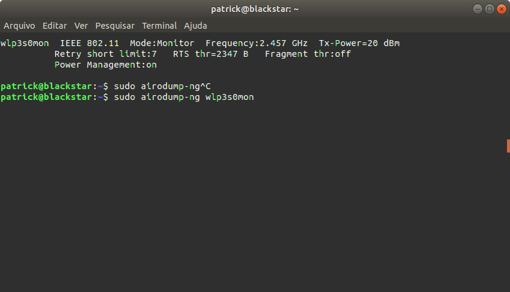
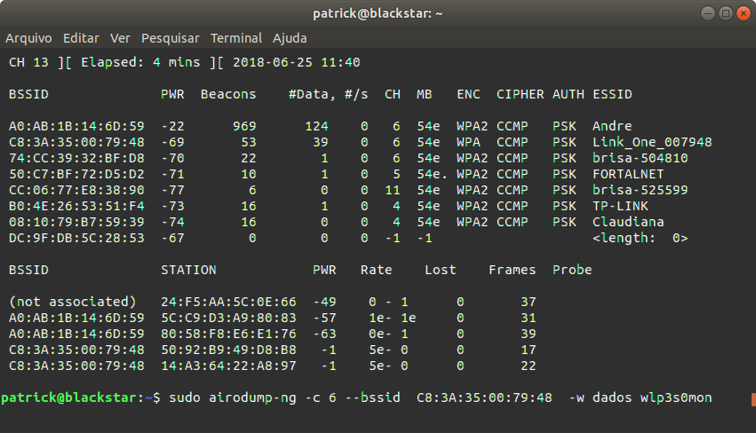
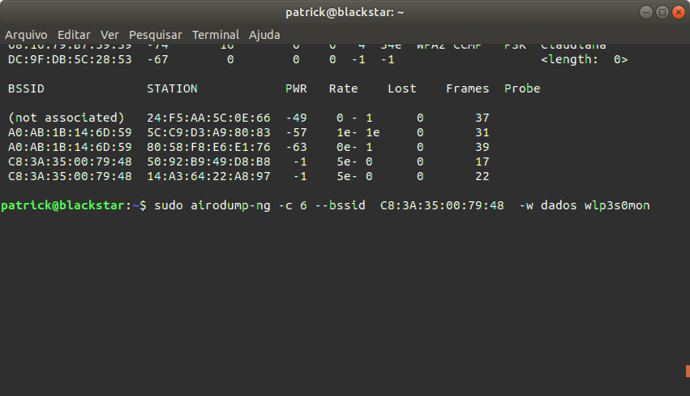
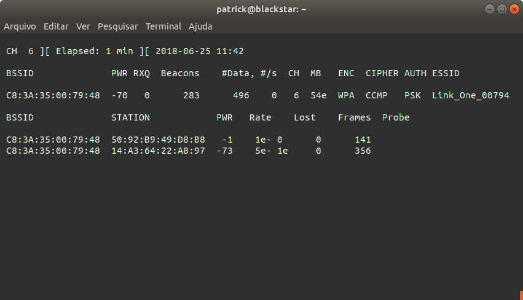
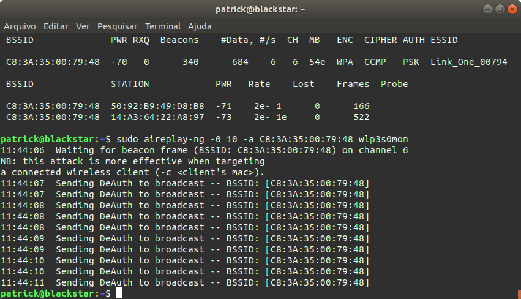

## Prática de Invasão Wifi

Prática Ubuntu

#### Atividade

Verificando o nome da minha interface Wi-FI e reconhecendo o driver de internet sem fio

Verificando se tem algum processo que pode acabar atrapalhando o processo de captura de pacotes

Colocando minha placa de rede em modo monitor:

Observando quais são as redes disponíveis para nossos possíveis ataques

Monitorando Rede do possível ataque

Capturando o Handshake

Os passo seguintes não foram possíveis, pois o handshake não foi capturado.

