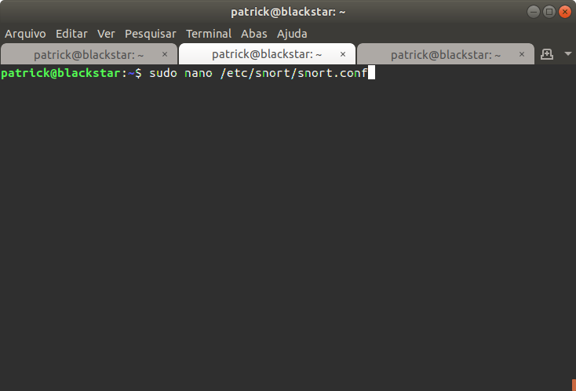
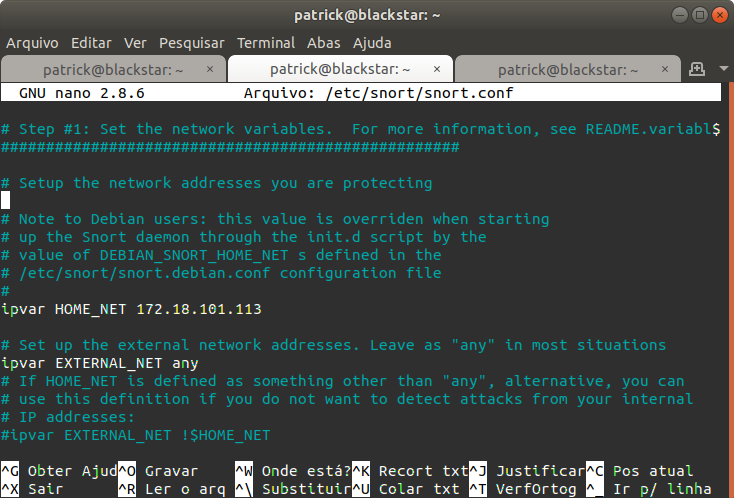

## Prática de IDS

Prática Ubuntu

#### Atividade

monitorando a rede

Colocando o ip para ser monitorado, no caso o escolhido foi 171.18.101.113

Dando restart no serviço

Não foi possível deixar o snort em modo de detecção de ataques

